 

 

<table>
  <tr>
    <td></td>
    <td></td>
  </tr>
</table>

## 👋 About Me

I'm an Information Science and Engineering student building a strong foundation in frontend development. I enjoy turning ideas into clean, responsive interfaces and learning how to structure projects well.

- 🌱 Currently learning **React, TypeScript, and modern frontend development**
- 🔭 Building and deploying **React applications**
- 🧭 Focused on clean project structure, UI architecture, and Git workflows
- 🤝 Open to learning opportunities, collaboration, and technical discussions

## 🛠️ Tech Stack

-0B0F1A?style=for-the-badge&logo=c&logoColor=D4AF37)

## 🚀 Featured Project

### [React To‑Do App](https://react-to-do-app-kevalxd.vercel.app/)

A live React project where I practice building and deploying useful frontend applications. [Open the app](https://react-to-do-app-kevalxd.vercel.app/).

## ✨ Contribution Graph

<!-- Generated daily by .github/workflows/update-profile-art.yml → contrib-heatmap.svg -->

## 📊 GitHub Activity

 

## 📫 Let's Connect

I'm always happy to connect about frontend development, projects, and learning together. Visit my [GitHub profile](https://github.com/KevalXD) or try my [live To‑Do app](https://react-to-do-app-kevalxd.vercel.app/).

